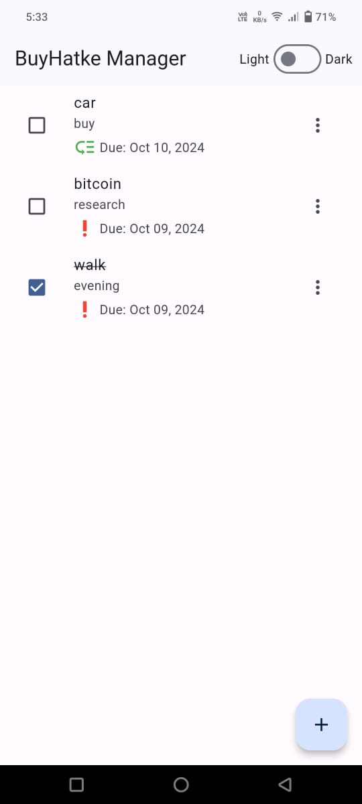
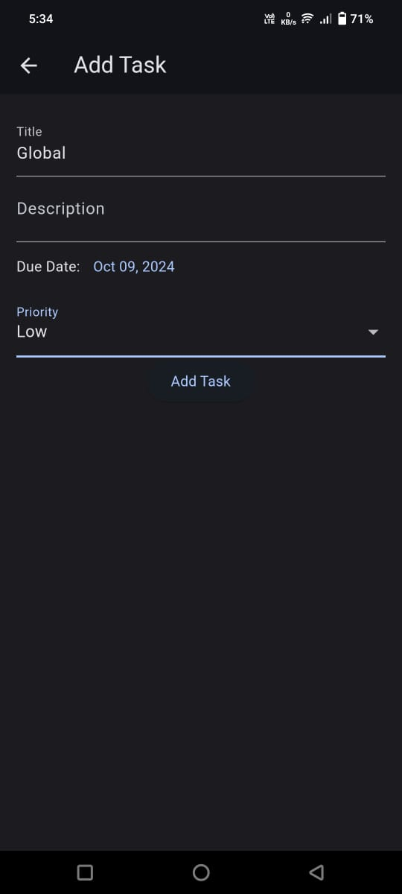
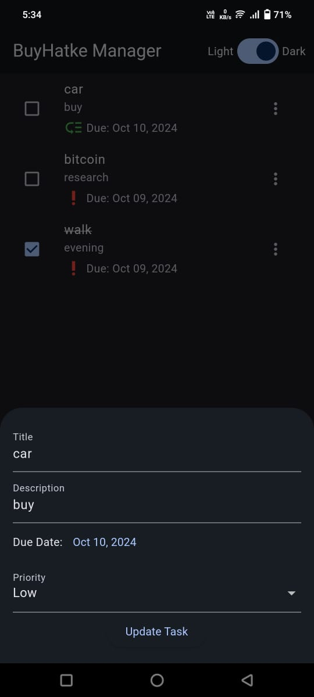
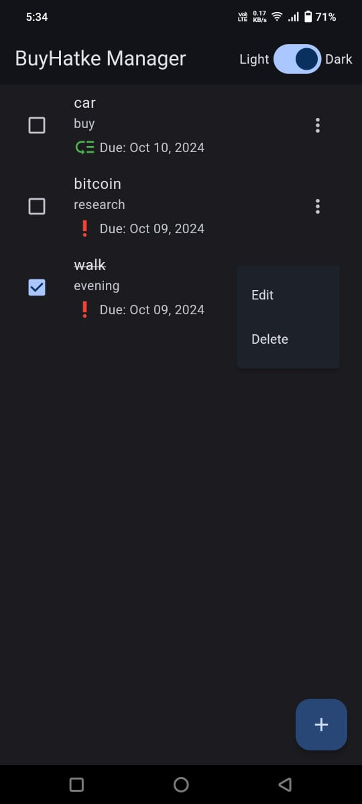
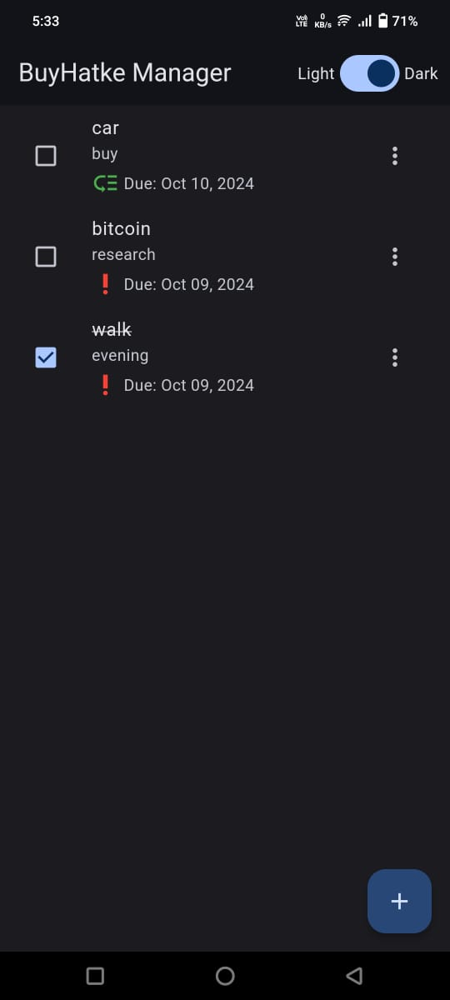

# buyhatke

# Personal Task Manager App

## Project Overview

The Personal Task Manager App is a Flutter-based application developed in Android Studio that allows users to efficiently manage their daily tasks. It includes basic CRUD operations, enabling users to create, read, update, and delete tasks. Each task consists of fields such as title, description, due date, priority level, and completion status, providing an organized approach to manage personal or professional errands. The app also offers a user-friendly interface with theme customization through a simple slider in the AppBar. Tasks are stored locally on the device using an SQLite database for persistent storage.

## Setup Instructions

To set up and run the project locally, follow these steps:

1. **Clone the Repository**:
   ```bash
   git clone https://github.com/BAHUBALI2550/buyhatke_assessment.git

2. Install Dependencies: Open a terminal in the project directory and run:
   flutter pub get
   android studio: open the pubspec.yaml file and run pub get

3. Run the Application: Ensure you have a connected device or emulator, then execute:

   then run the main.dart

## Explanation of Key Design Decisions and Features

### Floating Action Button: Allows users to add new tasks by opening an input form. This button is prominently placed for quick access, following material design guidelines.

### Edit and Update: Tasks can be edited and updated using the three-dot menu and edit option, which offers an intuitive interface for modifying task details.

### Theme Customization: A slider in the AppBar enables users to switch the app's theme, allowing for a personalized user experience.

### Local Storage Using SQLite: Ensures that tasks are stored locally on the device, facilitating data persistence across sessions without the need for external or online storage.

## Screenshots

Home Screen: Displaying the list of tasks with CRUD operations. 
<p align="center">

<br/>

Add Task: Form to input new task details.
<p align="center">

<br/>

Edit Task: Interface for updating existing task details.
<p align="center">

<br/>

<p align="center">

<br/>

Theme Slider: AppBar with the theme customization option. 
<p align="center">

<br/>